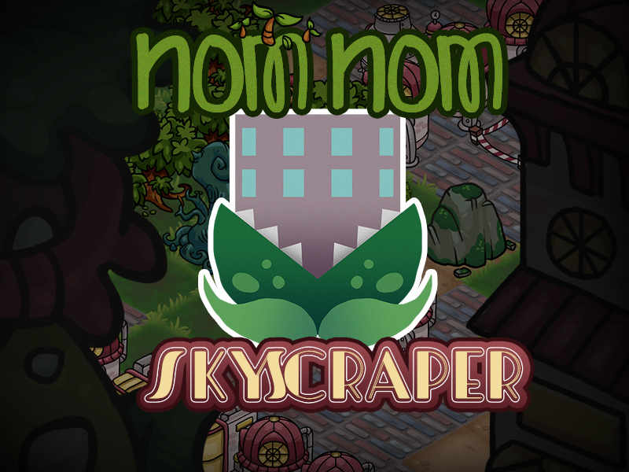

# Nom Nom Skyscraper

*A balanced diet of concrete and veggies.*

**Nom Nom Skyscraper** is a game where the player has to strategically place different wild plant life or buildings on a map to balance between nature and industry.

Your task is to have at least 25 % of fields filled with both, industry and wilderness but you need to keep it at a good balance. If one dominates the other you will lose the game.

The placed cards on the map can take effect on each other. Each field has a "wilderness" and an "industry" value. Once the value is bigger than 4 it also starts spawning additional buildings or plant life.

The most basic unit is a hut for industry and tree for wilderness. They can only be placed on fields that already have a wilderness or industry value, so only next to spaces where another building or plant has already been placed.

## Screenshots
Game in the beginning

After playing some cards

More Screenshots in the Screenshot folder

## Linksammlung
- Miro Board: https://miro.com/app/board/uXjVOSxW3jY=/
- Godot Engine: https://godotengine.org/
- GGJ Page: https://globalgamejam.org/2022/games/duality-3-0
